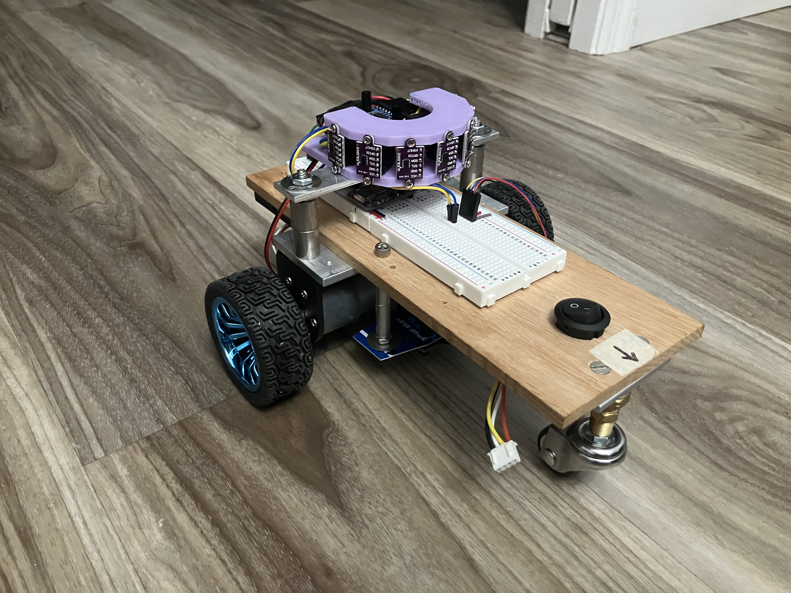
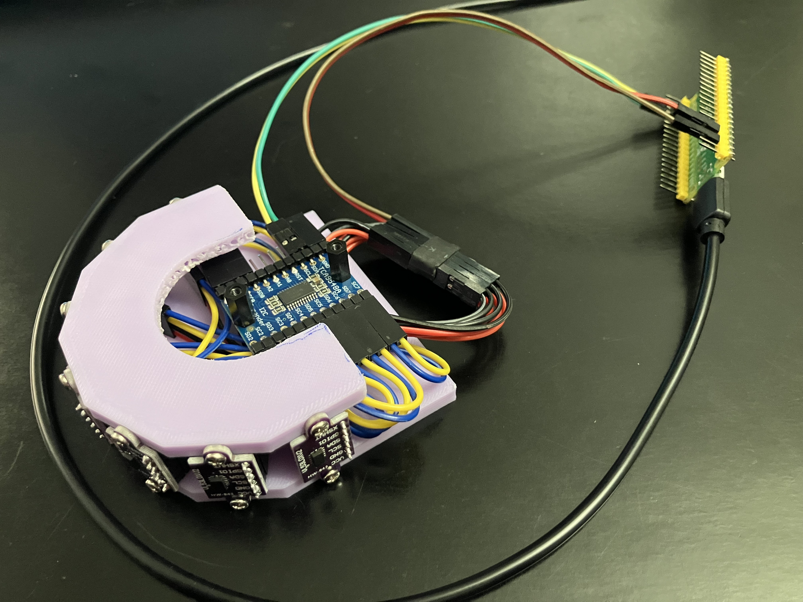
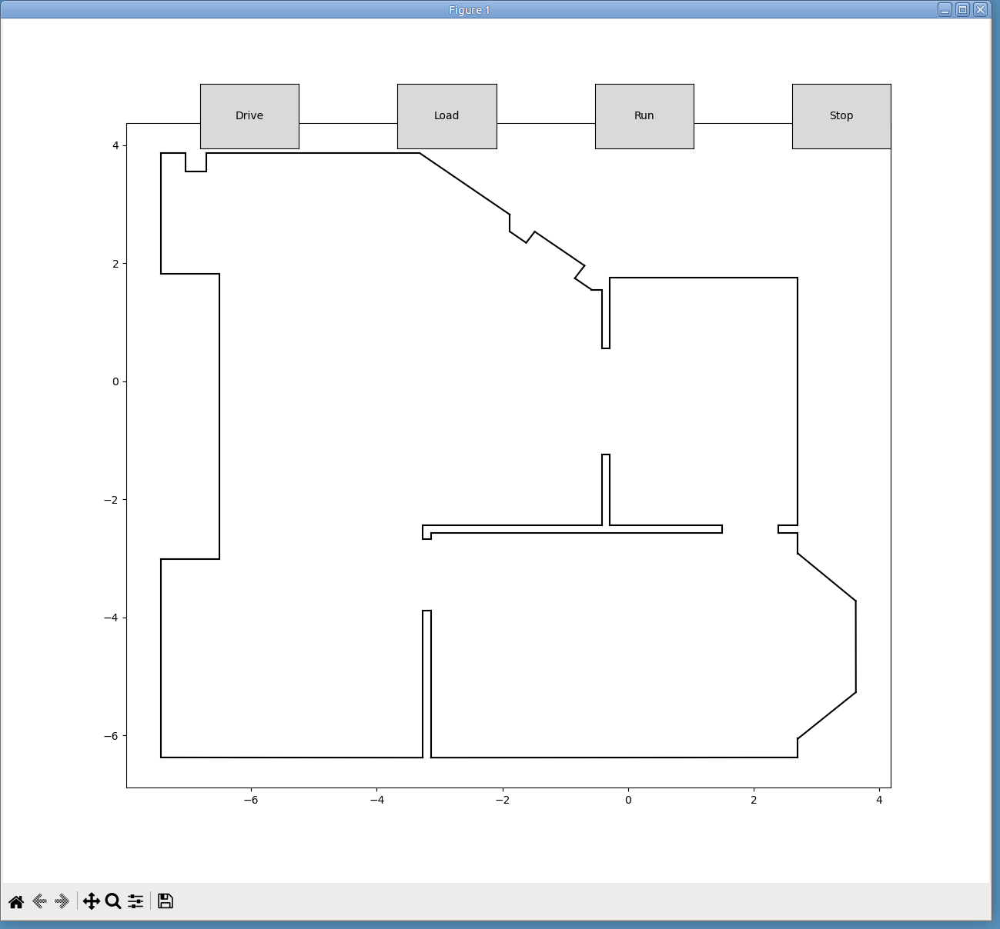
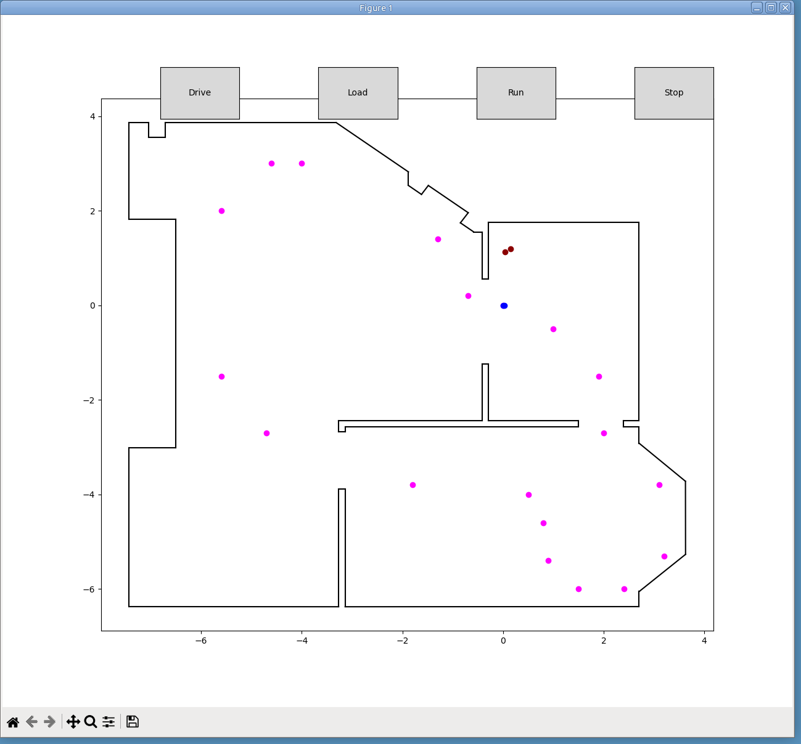
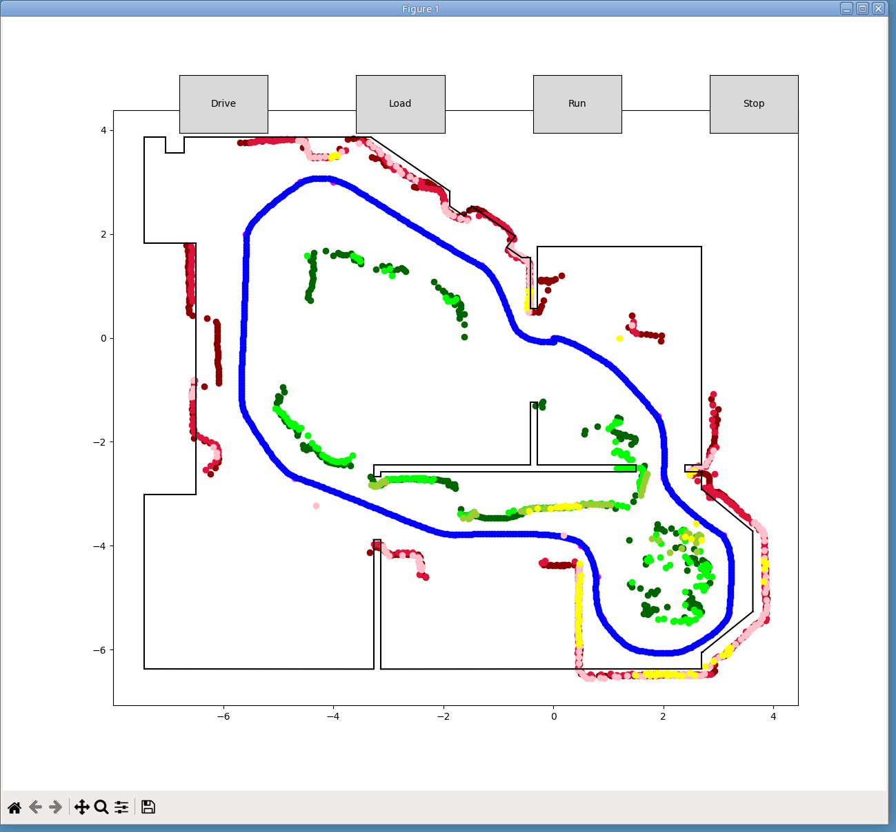
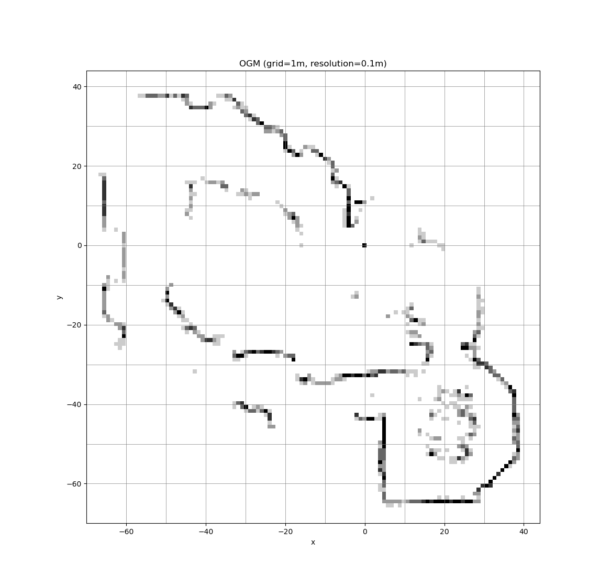

# PicoBot with Circular Array of Distance Sensors
* This project is based on its predecessor: [PicoBot-oto](https://github.com/dblanding/PicoBot-oto).
* Although it has been my habit to build DIY projects with whatever components I can find laying around my shop, I found it helpful to build a [CAD model](PicoBot-cads.step) for this robot for a couple of reasons:
    * I needed  a couple of 3D printed parts for the sensor array.
    * I wanted to make sure the sensor array ended up at the right height to match the lower shelf of the furniture in my living room.


https://github.com/user-attachments/assets/53fcd333-3603-44a6-9623-7bde302bacb5




## Circular Array of Distance Sensors
* 7 VL53L0x time-of-flight VCSEL devices arranged in a 180-deg arc
* Positioned at 9:00 through 3:00 (clock face positions)
    * Sensor **A** at 9:00 looks straight LEFT
    * Sensor **D** at 12:00 looks straight ahead
    * Sensor **G** at 3:00 looks straight RIGHT
* Sensors are connected through an I2C MUX to Pico
* Array data is a list of 7 distance (mm) values [A, B, C, D, E, F, G]



## Bi-directional data exchange between laptop and PicoBot
* The Adafruit Bluefruit LE UART Friend device onboard the PicoBot operates as a peripheral device (server) in BLE (Bluetooth Low Energy) communication.
* When the PicoBot is powered up, the BLE UART Friend device begins advertising its presence and waiting for a central device to connect and establish a connection.
* A Python program on the laptop can then be started. It acts as a client, first scanning for the BLE UART Friend, then connecting to it.
* Once connected, bi-directional communications can begin.
    * The client program can send driving instructions to the server.
    * The server can respond by sending messages back to the client.

## The example below shows this process in detail.

* Initially, the PicoBot is placed in its home position at coordinates (0, 0), carefully aligned to point exactly in the **X** direction.
* The PicoBot is switched on, and is undisturbed while the Optical Tracking Sensor self calibrates.
* Next, the `controller_display` program on the laptop is started.
    * Once the connection with the PicoBot is made, a window opens, displaying a map of the arena boundaries.



* The window has 4 buttons, labeled **Drive**, **Load**, **Run**, and **Stop**.
* Click the **Run** button first to start the robot `main()` function running.
* Next, click the **Load** button.
    * This causes a generator to be created from a list of driving instructions.
* Finally, click on the **Drive** button, which gets the `next` instruction from the generator, sends it to the robot, waits for it to be complete, then gets the `next` instruction and the `next`... until there are no more instructions.
    * Each instruction is a one item dictionary, where the `key` is the drive command and the `value` is the parameter value.
    * The table below shows the available driving instructions 

Instruction | key | value
------------|-----|-------
Send WayPoints to robot |"SWP"| list of points (x, y)
Drive Waypoints (driving Forward) | "DWF" | None (drive the list of points in sequence)
Drive Waypoints (driving in Reverse) | "DWR" | None (drive the list of points in sequence)
Turn in place to Goal Heading | "TGH" | Heading angle (radians)
Turn in place by Relative Angle | "TRA" | Relative angle (radians)

## Typical Loop Run
* Here are the driving instructions of a run in which the robot is instructed to drive in a loop around the perimeter of the arena.

```
wapo_list = [
    (1.0, -0.5),
    (1.9, -1.5),
    (2.0, -2.7),
    (3.1, -3.8),
    (3.2, -5.3),
    (2.4, -6.0),
    (1.5, -6.0),
    (0.9, -5.4),
    (0.8, -4.6),
    (0.5, -4.0),
    (-1.8, -3.8),
    (-4.7, -2.7),
    (-5.6, -1.5),
    (-5.6, 2.0),
    (-4.6, 3.0),
    (-4.0, 3.0),
    (-1.3, 1.4),
    (-0.7, 0.2),
    (0.0, 0.0)
    ]

instrux_list = [
    {"!SWP": wapo_list,},
    {"!DWF": None,},
    {"!TGH": 0,},
    ]
```
* The instruction list has just 3 lines:
    * Send the waypoint list to the robot
    * Drive the waypoints in sequence
    * Turn in place to Global Heading 0
* During execution of the first instruction, the waypoints are displayed (in Magenta color)
* When the robot begins to execute the second instruction (begins driving to the 1st waypoint), its location is shown as a Blue dot.



* As the robot drives, data points are continually added to the display
    * Robot path is shown as Blue dots.
    * Obstacles detected by the sensors are shown in various colors (different color for each sensor)
        * Reds on the left, Greens on the right, darkest shades abeam, Yellow straight ahead.



* Upon completion of the run, the output of the `controller_display` program has been manually saved as `run_data.py` which can then be analyzed by `run_analyzer.py`.

```
Total number of lines in file:  3393
Total number of time steps: 570
Average value of time step: 0.16 seconds
Data rate: 6.13 Hz
Duration of run: 93.02 seconds
```

* Also, at the end of the run, the `controller_display` program automatically saves all the collected robot data in the file `saved_data.py`
* The program `my_ogm.py` constructs an Occupancy Grid Map (OGM) from this saved data.



