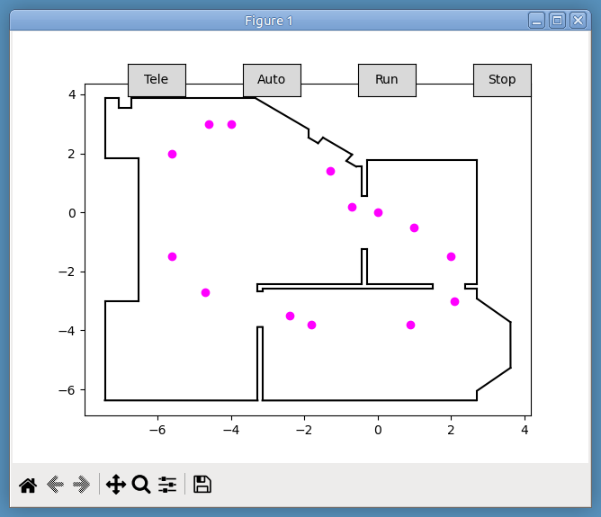

# PicoBot with Circular Array of Distance Sensors
* This project is based on its predecessor: [PicoBot-oto](https://github.com/dblanding/PicoBot-oto).
* Although it has been my habit to build DIY projects with whatever components I can find laying around my shop, I found it helpful to build a [CAD model](PicoBot-cads.step) for this robot for a couple of reasons:
    * I needed  a couple of 3D printed parts for the sensor array.
    * I wanted to make sure the sensor array ended up at the right height to match the lower shelf of the furniture in my living room.


## Circular Array of Distance Sensors
* 7 VL53L0x time-of-flight VCSEL devices arranged in a 180-deg arc
* Positioned at 9:00 through 3:00 on a clock face
    * Sensor **A** at 9:00 looks straight LEFT
    * Sensor **D** at 12:00 looks straight ahead
    * Sensor **G** at 3:00 looks straight RIGHT
* Sensors are connected through an I2C MUX to Pico
* Array data is a list of 7 distance (mm) values [A, B, C, D, E, F, G]


## Bi-directional data exchange between laptop and PicoBot
* The Adafruit Bluefruit LE UART Friend device on the PicoBot operates as a peripheral device (server) in BLE (Bluetooth Low Energy) communication.
* When the PicoBot is powered up, the BLE UART Friend device begins advertising its presence and waiting for a central device to connect and establish a connection.
* When the Python program on the laptop is started, it acts as a client, first scanning for the BLE UART Friend, then connecting to it.
* Once connected, the client program sends waypoints to the server.
* After all waypoints have been sent, the client sends a `!C` code to the server, which responds by sending the number of points received.
* If the number of points sent matches the number received, the laptop program draws a map showing the arena boundaries and the location of the waypoints (magenta).



* The map also has 4 buttons, labeled **Tele**, **Auto**, **Run**, and **Stop**.
* Clicking on the **Tele** button causes a code `!T` to be sent to the server, putting the PicoBot into *Tele-op* mode.
* Similarly, the **Auto** button sends code `!A` to the server, setting the mode to *Automatically* drive from waypolint to waypoint in sequence. 
* When the **Run** buton is clicked, code `!R` is sent. When the PicoBot receives this code, it begins to drive in the enabled mode.
    * While driving, the PicoBot sends *dictionary-like* data to the laptop encoded as json *bytestrings*.
    * When the data is received on the laptop, it is displayed on the map.
* Clicking on the **Stop** button sends code `!S`, causing the PicoBot to stop immediately.

## Typical Loop Run
* Robot is in *Auto* mode, drives sequentially to 14 waypoints, stopping at the last one.
* Robot path is shown as BLUE dots.
* Sensors A (RED), G (GRN) & D (YEL) show obstacles detected.

```
Total number of lines in file:  2661
Total number of time steps: 440
Average value of time step: 0.17 seconds
Data rate: 5.92 Hz
Duration of run: 74.35 seconds
```


## Next step:
* My plan is to use data from sensors B, C, D, E & F to discover and steer toward *open* space (rather than to prescripted waypoints). Sensors A & G would continue to map obstacles detected on the LEFT and RIGHT.
